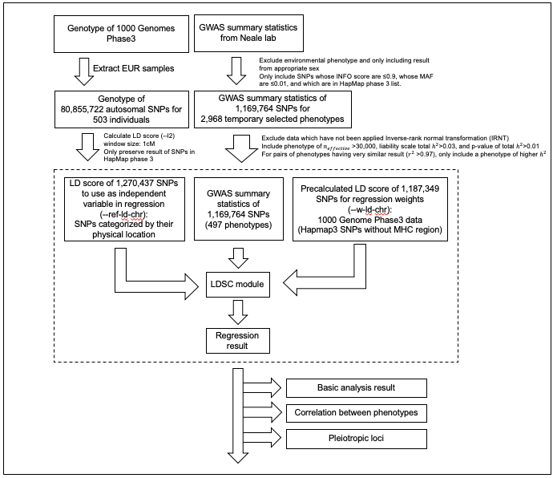

# Regional Heritability Analysis `v1.0`

<!--
[](https://zenodo.org/badge/latestdoi/)
-->

## Introduction

`Regional Heritability Analysis`  is a software package for estimating regional heritability of small genomic segments.

The estimated regional heritability over different scales (chromosome, 128Mb, 64Mb, 32Mb, 16Mb, and 8Mb) simultaneously shown in a nested donut plot. The chromosome to which each segment belongs are indicated by background color of the segment. Fraction of heritability which each segment explains can be measured using outer circular gauge. For plots across all traits, visit our website (Regional Heritability Atlas, https://h2atlas.hanlab.snu.ac.kr). 

### Example
#### Nested donut plot

#### Comparison of regional heritability between two traits

#### Correlation between phenotypes calculated from regional heritability


## Functionality
This package provides full pipeline of data analysis from downloading data to visualizing results.
* download GWAS summary statistics from Neale lab
* download raw genotype data of 1000 Genome phase3 in plink format
* munge summary statistics (wrapper for munge_sumstats.py from https://github.com/bulik/ldsc)
* calculate LD score (wrapper for ldsc.py --l2 from https://github.com/bulik/ldsc)
* running LD score regression (wrapper for ldsc.py --h2 from https://github.com/bulik/ldsc)
* visualize analysis result
    * ANOVA
    * Nested donut plot
    * correlation between phenotypes
* building website (demo: Regional Heritability Atlas, https://h2atlas.hanlab.snu.ac.kr)


## Directory structure

```

├── data
│   ├── 1000G_Phase3_weights_hm3_no_MHC
│   ├── 1000G_plink_EUR
│   ├── 1000G_plink_EUR_temp
│   ├── hapmap3_snps
│   ├── out_sumstats
│   ├── out_annot
│   └── out_final
├── web
│   └── 1000G_Phase3_weights_h
├── 1_downlaod_gwas_neale.ipynb
├── 2_munge_1000G_genotype.ipynb
├── 3_munge_sumstats.ipynb
├── 4_make_annot_ldscore.ipynb
├── 5_filtering_phenotypes_1.ipynb
├── 5_filtering_phenotypes_2.ipynb
├── 5_run_ldsc.ipynb
├── 6_saving_and_basic_qc.ipynb
├── 7_1_nested_donut_plot.ipynb
├── 7_2_anova.ipynb
├── 7_3_variance.ipynb
├── 7_4_correlation.ipynb
├── 7_5_pca.ipynb
├── 7_6_pleiotropic.ipynb
├── 7_7_alluvial.ipynb
├── 7_8_basic_qc.ipynb
├── 7_9_phenotype_info.ipynb
├── 8_bokeh.ipynb

```


we used LD score regression to estimate regional heritability of small genomic segments and examined if the heritability is evenly distributed across segments in each phenotype. We split genome with various constant physical lengths, as it turned out that the distribution of heritability across segments depends on the segment size in some phenotypes. Additionally, using the regional heritability data, we investigated relationship among the traits included in our analysis and searched for pleiotropic loci contributing much of heritability to many traits. We present our analysis results of 497 traits in our interactive online database 


We measure  <ins>(1) to xxxx</ins> and <ins>(2) to xxxxx</ins>.

## Instructions
### Overview of data flow

### Environment
`Regional Heritability Analysis` is tested on `Linux`.

### Downloading the package
In order to download `Regional Heritability Analysis`, you can clone this repository.


```
$ git clone https://github.com/ch6845/regional_heritability_analysis.git
$ cd regional_heritability_analysis
```
### Installing required dependencies
Some software packages must be installed.

First, please make sure that [PLINK](http://zzz.bwh.harvard.edu/plink/download.shtml) is installed. The installed plink path should be added to the system path. <br>
You can verify by

```
$ plink --version
```

Also, you should install [python3](https://www.python.org/downloads/) and [pip](https://pip.pypa.io/en/stable/installing/) or [anaconda](https://www.anaconda.com/distribution/#download-section) for downloading the following necessary python packages :

--
- numpy
- pandas
- scipy
- datatable

If you are using Python, you can install the required packages with:

```
$ pip install -U numpy pandas scipy datatable
```

If you are using Anaconda, you can install the required packages with:

```
$ conda install -c conda-forge numpy pandas scipy pip
$ pip install datatable
```

### Input data format
The input data has to be in [PLINK](https://www.cog-genomics.org/plink2/input)
format. <br>
Please ensure that the `.bed/.bim/.fam` filesets or `.map/.ped` filesets are all present in the same path. When you run the code, you should give the path and prefix of the data.


### Distance Vector Generation (1.DV_Generator)
Our first module is for generating a distance vector.
There are two usages.

#### Usage 1: Dssss


### Running the test example at one go


License
---------
This project is licensed under the terms of the MIT license.


## Citation
If you use the software `Regional Heritability Analysis`, please cite [Kim and Han. Landscape of polygenicity of complex traits in UK Biobank. (under review) (2019)](www.)

## Reference
1. [PLINK v1.9](www.cog-genomics.org/plink/2.0/) | Chang, Christopher C., et al. "Second-generation PLINK: rising to the challenge of larger and richer datasets." Gigascience 4.1 (2015): 7.
2. [1000 Genome Phase 3 data](https://www.cog-genomics.org/plink/2.0/resources) | 1000 Genomes Project Consortium. "A global reference for human genetic variation." Nature 526.7571 (2015): 68.
3. [LD Score regression](https://github.com/bulik/ldsc) | Bulik-Sullivan, Brendan K., et al. "LD Score regression distinguishes confounding from polygenicity in genome-wide association studies." Nature genetics 47.3 (2015): 291.
3. [Genetic map](https://mathgen.stats.ox.ac.uk/impute/impute_v2.html) | Howie, Bryan N., Peter Donnelly, and Jonathan Marchini. "A flexible and accurate genotype imputation method for the next generation of genome-wide association studies." PLoS genetics 5.6 (2009): e1000529.


## Support
This software was implemented by Chanwoo Kim. Please contact [ch6845@snu.ac.kr](mailto:ch6845@snu.ac.kr)