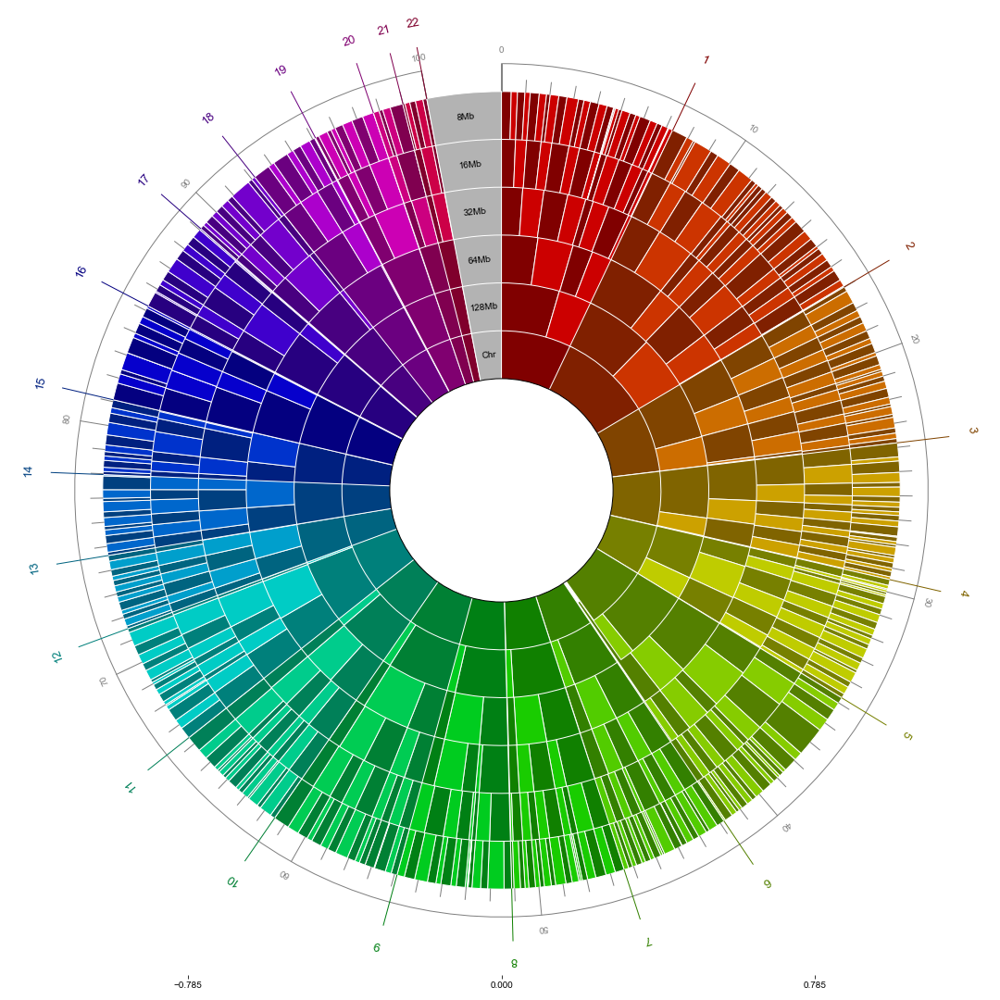

Regional Heritability Analysis `v1.0`
===================
[](https://zenodo.org/badge/latestdoi/)

Introduction
------------
`Regional Heritability Analysis`  is a software package for a



We measure  <ins>(1) to xxxx</ins> and <ins>(2) to xxxxx</ins>.

Instructions
-------------
### Environment
`Regional Heritability Analysis` is tested on `Linux`.

### Downloading the package
In order to download `Regional Heritability Analysis`, you can clone this repository.


```
$ git clone https://github.com/ch6845/regional_heritability_analysis.git
$ cd regional_heritability_analysis
```
### Installing required dependencies
Some software packages must be installed.

First, please make sure that [PLINK](http://zzz.bwh.harvard.edu/plink/download.shtml) is installed. The installed plink path should be added to the system path. <br>
You can verify by

```
$ plink --version
```

Also, you should install [python3](https://www.python.org/downloads/) and [pip](https://pip.pypa.io/en/stable/installing/) or [anaconda](https://www.anaconda.com/distribution/#download-section) for downloading the following necessary python packages :

--
- numpy
- pandas
- scipy
- datatable

If you are using Python, you can install the required packages with:

```
$ pip install -U numpy pandas scipy datatable
```

If you are using Anaconda, you can install the required packages with:

```
$ conda install -c conda-forge numpy pandas scipy pip
$ pip install datatable
```

### Input data format
The input data has to be in [PLINK](https://www.cog-genomics.org/plink2/input)
format. <br>
Please ensure that the `.bed/.bim/.fam` filesets or `.map/.ped` filesets are all present in the same path. When you run the code, you should give the path and prefix of the data.


### Distance Vector Generation (1.DV_Generator)
Our first module is for generating a distance vector.
There are two usages.

#### Usage 1: Dssss


### Running the test example at one go


Greedy Algorithm
-----------------
xxxxxx

License
---------
This project is licensed under the terms of the MIT license.


Citation
----------
If you use the software `Regional Heritability Analysis`, please cite [Kim et al. xxxxxxs. (under review) (2019)]

Reference
------------
1. [PLINK v1.9](www.cog-genomics.org/plink/2.0/) | Chang CC, Chow CC, Tellier LCAM, Vattikuti S, Purcell SM, Lee JJ Second-generation PLINK: rising to the challenge of larger and richer datasets. GigaScience, 4. (2015) doi:10.1186/s13742-015-0047-8
2. [1000 Genome Phase 3 data](https://www.cog-genomics.org/plink/2.0/resources) | A global reference for human genetic variation, The 1000 Genomes Project Consortium, Nature 526, 68-74 (2015) doi:10.1038/nature15393


Support
----------
This software was implemented by Chanwoo Kim. Please contact [hanlab.snu@gmail.com](mailto:hanlab.snu@gmail.com)