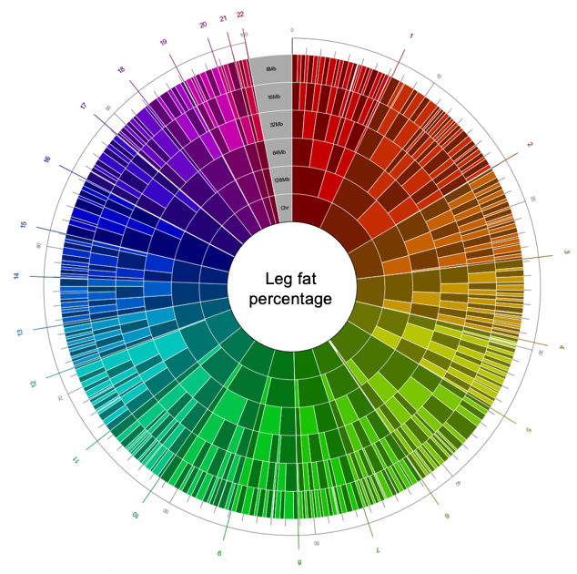
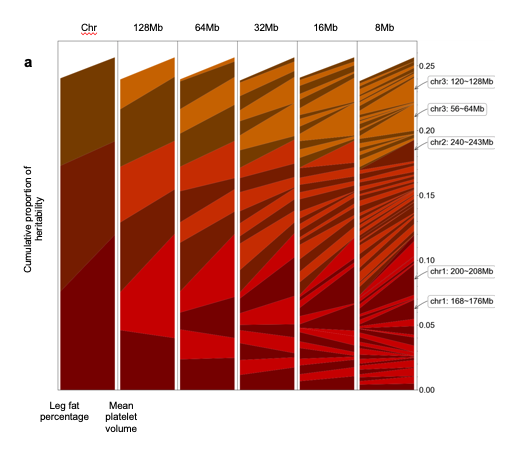
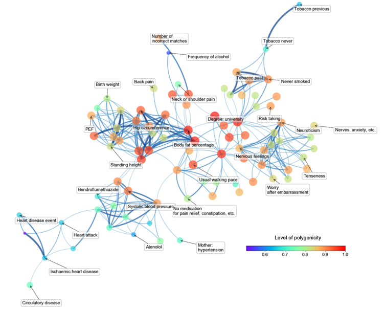

# Regional Heritability Analysis `v1.0`

<!--
[](https://zenodo.org/badge/latestdoi/)
-->

## Introduction

`Regional Heritability Analysis`  is a software package for estimating regional heritability of small genomic segments. It uses LD score regression to estimate regional heritability of small genomic segments and examined if the heritability is evenly distributed across segments in each phenotype. Additionally, using the regional heritability data, we investigated relationship among the traits included in our analysis and searched for pleiotropic loci contributing much of heritability to many traits. For analysis result across all traits, visit our interactive database website (Regional Heritability Atlas, http://h2atlas.hanlab.snu.ac.kr). 

## Example
### Nested donut plot


The estimated regional heritability over different scales (chromosome, 128Mb, 64Mb, 32Mb, 16Mb, and 8Mb) simultaneously shown in a nested donut plot. The chromosome to which each segment belongs are indicated by background color of the segment. Fraction of heritability which each segment explains can be measured using outer circular gauge. 
### Comparison of regional heritability between two traits


The chromosome to which each segment belongs are indicated by color of the segment.
 
### Correlation between phenotypes calculated from regional heritability



## Main functionality
This package provides full pipeline of data analysis from downloading data to visualizing results.
* Data pre-processing
    * download GWAS summary statistics from Neale lab
    * download raw genotype data of 1000 Genome phase3 in plink format
    * munge summary statistics (wrapper for munge_sumstats.py from https://github.com/bulik/ldsc)
    * calculate LD score (wrapper for ldsc.py --l2 from https://github.com/bulik/ldsc)
    * run LD score regression (wrapper for ldsc.py --h2 from https://github.com/bulik/ldsc)
* Analyze and visualize result
    * level of polygenicity
    * analysis of variance
    * nested donut plot
    * pleiotropic loci identification
    * correlation between phenotypes
* Build database website (demo: Regional Heritability Atlas, http://h2atlas.hanlab.snu.ac.kr)


## Recommended (not necessary) directory structure 
path can be configured in `path_configure.py`
```
├── data
│   ├── 1000G_Phase3_weights_hm3_no_MHC
│   ├── 1000G_plink_EUR
│   ├── 1000G_plink_EUR_temp
│   ├── hapmap3_snps
│   ├── out_sumstats
│   ├── out_annot
│   └── out_final
├── web
│   └── partitioned_heritability_website
│       └── plot_data
├── log_parser.py
├── path_configure.py
├── basic_tools.py
├── 1_downlaod_gwas_neale.ipynb
├── 2_munge_1000G_genotype.ipynb
├── 3_munge_sumstats.ipynb
├── 4_make_annot_ldscore.ipynb
├── 5_filtering_phenotypes_1.ipynb
├── 5_filtering_phenotypes_2.ipynb
├── 5_run_ldsc.ipynb
├── 6_saving_and_basic_qc.ipynb
├── 7_1_nested_donut_plot.ipynb
├── 7_2_anova.ipynb
├── 7_3_variance.ipynb
├── 7_4_correlation.ipynb
├── 7_5_pca.ipynb
├── 7_6_pleiotropic.ipynb
├── 7_7_alluvial.ipynb
├── 7_8_basic_qc.ipynb
├── 7_9_phenotype_info.ipynb
└── 8_bokeh.ipynb

```

## Instructions

### Environment
This software was tested on `Linux` (especially on CentOS 7).

### Downloading the package
In order to download `Regional Heritability Analysis`, you can clone this repository.
```
$ git clone https://github.com/ch6845/regional_heritability_analysis.git
$ cd regional_heritability_analysis
```
### Installing required dependencies
Some software packages must be installed.
* PLINK (download from https://www.cog-genomics.org/plink/1.9/)
    * make sure PLINK is added to the sysmtem path. verify it by `plink --version`
* Python 3.7.3 (downlod from https://www.python.org/ or https://www.anaconda.com/ and install following packages using `pip install` or `conda install` command)
    * Numpy 1.16.3
    * Pandas 0.24.2
    * Scikit-learn 0.21.2
    * SciPy 1.3.0
    * Matplotlib 3.0.3
    * Seaborn 0.9.0
    * Network 2.3,
* LDSC 1.0.0

For building web database,
* R 3.5.2
* Hugo 0.58.0
* Bokeh 1.3.4
* DataTables 1.10.19

### Pipeline
1. `1_downlaod_gwas_neale.ipynb` Download UK Biobank GWAS summary statistics from Neale lab
2. `2_munge_1000G_genotype.ipynb` Prepare raw genotype of 1000 Genome project Phase 3 for building LD score reference panel
3. `3_munge_sumstats.ipynb` Munge summary statistics
4. `4_make_annot_ldscore.ipynb` Build LD score reference panel. Make use of its supporting bash shell argument . For example, run `jupyter nbconvert 4_make_annot_ldscore.ipynb --to script` and `python 4_make_annot_ldscore.py 64 bp`
5. Run LD score regression
    1. `5_filtering_phenotypes_1.ipynb` Filter phenotypes satisfiying QC conditions
    2. `5_filtering_phenotypes_2.ipynb`
    3. `5_run_ldsc.ipynb` Build LD score reference panel. Make use of its supporting bash shell argument. For example, run `jupyter nbconvert 5_run_ldsc.ipynb --to script` and `python 5_run_ldsc.py bp 64 10 0 500`
6. `6_saving_and_basic_qc.ipynb` Save result and check quaility
7. Analyze and visualizing result
    1. `7_1_nested_donut_plot.ipynb` Nested donut plot
    2. `7_2_anova.ipynb` Analysis of variance
    3. `7_3_variance.ipynb` Level of polygenicity
    4. `7_4_correlation.ipynb` Correlation between phenotypes included in analysis
    5. `7_5_pca.ipynb` Principal component analysis
    6. `7_6_pleiotropic.ipynb` Pleiotropic loci identification
    7. `7_7_alluvial.ipynb` Region-wise comparision of regional heritiability of segments
    8. `7_8_basic_qc.ipynb` Print quality check result
    9. `7_9_phenotype_info.ipynb` Exporting analysis result
8. `8_bokeh.ipynb` Build web database website automatically from analysis result

License
---------
This project is licensed under the terms of the MIT license.

## Citation
If you use the software `Regional Heritability Analysis`, please cite [Kim and Han. Landscape of polygenicity of complex traits in UK Biobank. (under review) (2019)](www.)

## References
1. [PLINK v1.9](www.cog-genomics.org/plink/2.0/) | Chang, Christopher C., et al. "Second-generation PLINK: rising to the challenge of larger and richer datasets." Gigascience 4.1 (2015): 7.
2. [1000 Genome Phase 3 data](https://www.cog-genomics.org/plink/2.0/resources) | 1000 Genomes Project Consortium. "A global reference for human genetic variation." Nature 526.7571 (2015): 68.
3. [LD Score regression](https://github.com/bulik/ldsc) | Bulik-Sullivan, Brendan K., et al. "LD Score regression distinguishes confounding from polygenicity in genome-wide association studies." Nature genetics 47.3 (2015): 291.
3. [Genetic map of GRCh build 37](https://mathgen.stats.ox.ac.uk/impute/impute_v2.html) | Howie, Bryan N., Peter Donnelly, and Jonathan Marchini. "A flexible and accurate genotype imputation method for the next generation of genome-wide association studies." PLoS genetics 5.6 (2009): e1000529.

To check full list of references, please refer to our publication.

## Support
If you have any question, please feel free to contact us [contact.h2atlas@gmail.com](mailto:contact.h2atlas@gmail.com)
<!--
This software was implemented by Chanwoo Kim. Please contact [ch6845@snu.ac.kr](mailto:ch6845@snu.ac.kr)
-->
